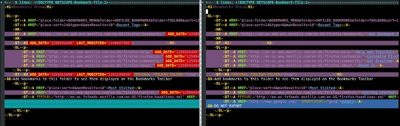
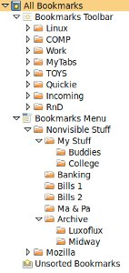
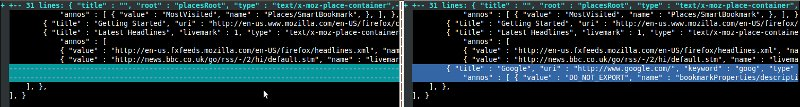

---
Bookmark Tools
---

#### Download

*   [https://github.com/nickshin/bookmark_tools/](https://github.com/nickshin/bookmark_tools/)

#### Project Description

This project originally started out as a backup and restore utility.
Some may ask why is something like this needed when there are already
some that exists out there.

I have tried using the following extensions:
*    [FEBE (Firefox Environment Backup Extension)](https://addons.mozilla.org/en-US/firefox/addon/febe/)
*    [Xmarks Sync](https://en.wikipedia.org/wiki/Xmarks_Sync) (formerly FoxMarks -- also, just recently shut down)
*    [Firefox Sync](https://www.mozilla.org/en-US/firefox/features/sync/) finally, a native bookmark syncing feature

But all of these didn't solve a few problems I was having.


##### Issue #1: sync

On my day to day operations, I work on a lot of different computers.
A few at the office, a few at my home, portables, etc.
Every now and then, my bookmarks on one computer doesn't match those on my
other ones.  ~~And it gets to be a real pain in the @$$ to try and re-sync
them.~~ (Firefox sync and sync tabs has come a long way providing this
exact feature -- and I really like it.)

The bookmarks, either in the HTML format or the JSON file (that's smashed
in to one line), contains extra data that I don't really need.
And, these make the diff proggy fill up the screen with a pile of cruft.

*    ADD_DATE="..."
*    LAST_MODIFIED="..."
*    ICON_URI="..."
*    ICON="..."

However, there is something I do need that's inlined with the bookmark
entry in addition to the description data that's kept on a separate line:

*    SHORTCUTURL="..."



Diff with false postive changes (in red) with interested valid ones (in blue).

##### Issue #2: scrub

Storing the bookmarks online sounded fun, but I wanted to do it with one
caveat.  Xmarks has private features as well as hosting bookmarks on your
own servers (this goes the same for Firefox Sync).
But, there are entries that I do not want published anywhere.

Say I would like to use the social features available for these online bookmark
features. But... I work with a lot of clients and accumulate a lot of
**internal** links that shouldn't be seen by outsiders.
Private features or not, a shared remote hosting site is still a non-trusted
location.  Intranet links describes network architectures that are very useful
for hackers or others with nefarious purposes.

Therefore, I needed a way to scrub my bookmarks.  One way is to allow bookmark
item be tagged within the Bookmark Organizer and a public-friendly version
can be exported.  Some items I filter out includes:

*    internal corporate/contracting networks
*    intranet at home
*    banking/investing accounts
*    bill pay accounts
*    health insurance
*    benefits info
*    stuff I keep track for my folks (you know you're the IT person for them...)
*    etc.



Bookmarks with personal folders that I do not wish to be made public.

##### In a nutt shell

The ability to sync bookmark data a little less painful meant sticking with
a human readable JSON data format.  This still allows for rapid backup and
restoration.  And, this allows me to use basic revision control systems to
track which bookmarks were deleted, moved or edited.



Diff of human readable streamlined JSON dataset.

* * *

##### A project using the Bookmark Scrubber

An example of using the generated bookmark scrubber output would be
[my bookmarks](demo/bookmarks.html) available online.


```
Thanks for visiting!
```

